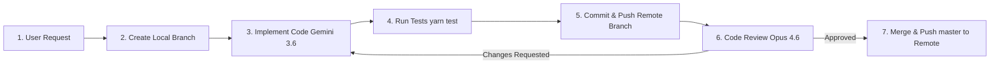

# Workspace Agent Guidelines & Architecture Rules

Welcome to the full-stack development environment. This document defines the core architecture, workflow conventions, sub-agent ecosystem, model matrix, git branching rules, testing standards, PR requirements, and code review workflows for AI agents operating on this project.

## Technology Stack Overview

- **Frontend**: Next.js 15, React 19 (Functional Components + Hooks), TypeScript, Ant Design (AntD v5/v6), SCSS Modules, Redux Toolkit / RTK Query, i18n.
- **Backend**: NestJS, TypeScript, SQLite, TypeORM, `class-validator`, `class-transformer`, Playwright Scrapers, Swagger / OpenAPI.

---

## 🤖 Sub-Agent Ecosystem & Model Matrix

| Agent Role | Skill Identifier | Base Model | Responsibility | Branch Strategy |
| :--- | :--- | :--- | :--- | :--- |
| **Orchestrator Agent** | `skills/agent-orchestrator` | **Gemini 3.6** | Decomposes user goals, creates task branches, dispatches sub-agents, triggers PRs & code reviews | `main` / management |
| **Frontend Agent** | `skills/frontend-next-antd` | **Gemini 3.6** | UI components, Next.js routes, Ant Design, RTK Query, SCSS modules | `feature/frontend-<task-name>` |
| **Backend Agent** | `skills/backend-nest-sqlite-typeorm` | **Gemini 3.6** | NestJS modules, TypeORM entities, SQLite migrations, Scrapers, DTOs | `feature/backend-<task-name>` |
| **QA / Tester Agent** | `skills/qa-testing` | **Gemini 3.6** | Writing unit tests, running Jest/Playwright tests, validating fixes | `test/<task-name>` |
| **Code Reviewer Agent** | `skills/code-reviewer` | **Opus 4.6** | Deep code review, security audit, architecture check, PR approval/rejection | N/A (Reviews PRs) |

---

## 🔄 Agent Task Lifecycle & Workflow Conventions

Every task assigned to a worker sub-agent MUST strictly adhere to the following 7-step remote pipeline:



### Step 1: Task Initialization & Unique Branch Creation
- Worker agents MUST NOT write code directly on `master`.
- Create a dedicated feature branch using naming convention:
  - `feature/frontend-<slug>` for client-side features
  - `feature/backend-<slug>` for backend features
  - `fix/<domain>-<slug>` for bug fixes
  - `test/<domain>-<slug>` for test coverage updates

### Step 2: Implementation (Gemini 3.6)
- Implement code strictly adhering to project conventions, type safety, modular architecture, and design tokens.

### Step 3: Automated Testing & Verification
- Prior to committing, run automated tests and linters:
  ```bash
  yarn type-check
  yarn lint
  yarn test
  ```
- No task is complete without passing test verification.

### Step 4: Commit & Push Task Branch to Remote Repository
- Commit changes using conventional commit formats (`feat: description`, `fix: description`, `refactor: description`).
- **Push the task branch to the remote repository**:
  ```bash
  git push -u origin <branch-name>
  ```
- Create Pull Request description utilizing the template at `.agents/templates/pr_template.md` targeting `master`.

### Step 5: Code Review by Code Reviewer Agent (Opus 4.6)
- The Pull Request is inspected by the **Code-Reviewer Agent** (powered by **Opus 4.6**).
- Review evaluates:
  1. **Strict TypeScript Compliance**: No `any`, proper interface usage, DTO validation.
  2. **Security & Data Safety**: User cookie safety, JWT handling, input sanitization.
  3. **Architecture & Design**: Modular structure, custom hooks usage, no monolithic files.
  4. **Performance & Styling**: Pure SCSS modules, no inline styles, optimized queries.

### Step 6 & 7: Approval, Merge & Remote Master Push
- Review outcomes:
  - **`APPROVED`**: Merge the feature branch into `master`, then **push updated `master` to remote**:
    ```bash
    git checkout master
    git merge <branch-name>
    git push origin master
    ```
  - **`CHANGES_REQUESTED`**: Worker agent resolves feedback on task branch, re-runs tests, pushes updated task branch (`git push`), and re-submits for review.

---

## Global Rules & Dos & Don'ts

### ✅ Dos
- **Strict TypeScript**: Always use explicit types and interfaces. Define shared types under `packages/types` or `src/types/`.
- **Functional Components**: Use React functional components with hooks exclusively.
- **SCSS Modules**: Style components using `*.module.scss`. Keep styles scoped and clean.
- **Modular NestJS Architecture**: Enforce feature-based modules (`src/modules/<feature>/`) on the backend.
- **DTO Validation**: Use `class-validator` and `class-transformer` on all incoming request payloads.
- **Documentation**: Keep `DOCUMENTATION.md` up to date with major system changes.
- **Git Commit Workflow**: Create granular git commits for each feature/fix (`feat: description`, `fix: description`, `refactor: description`).

### ❌ Don'ts
- ❌ Do NOT work directly on `main` branch.
- ❌ Do NOT use `any` under any circumstances.
- ❌ Do NOT use inline styles in React components (`style={{ ... }}`).
- ❌ Do NOT use `import React from 'react'`. In React 19 / Next.js automatic JSX transform is enabled.
- ❌ Do NOT write monolithic files. Break down components and extract custom hooks (`use*.ts`) or dedicated service methods.
- ❌ Do NOT bypass validation or leak database entities directly to the client without DTO transformation.

---

## File & Project Structure

```
.agents/
  ├── AGENTS.md
  ├── templates/
  │   └── pr_template.md
  ├── scripts/
  │   ├── create-agent-branch.ps1
  │   └── create-agent-branch.sh
  └── skills/
      ├── agent-orchestrator/
      │   └── SKILL.md
      ├── code-reviewer/
      │   └── SKILL.md
      ├── frontend-next-antd/
      │   └── SKILL.md
      ├── backend-nest-sqlite-typeorm/
      │   └── SKILL.md
      └── qa-testing/
          └── SKILL.md
```

Refer to the individual `SKILL.md` documents in `.agents/skills/` for role-specific execution details.

